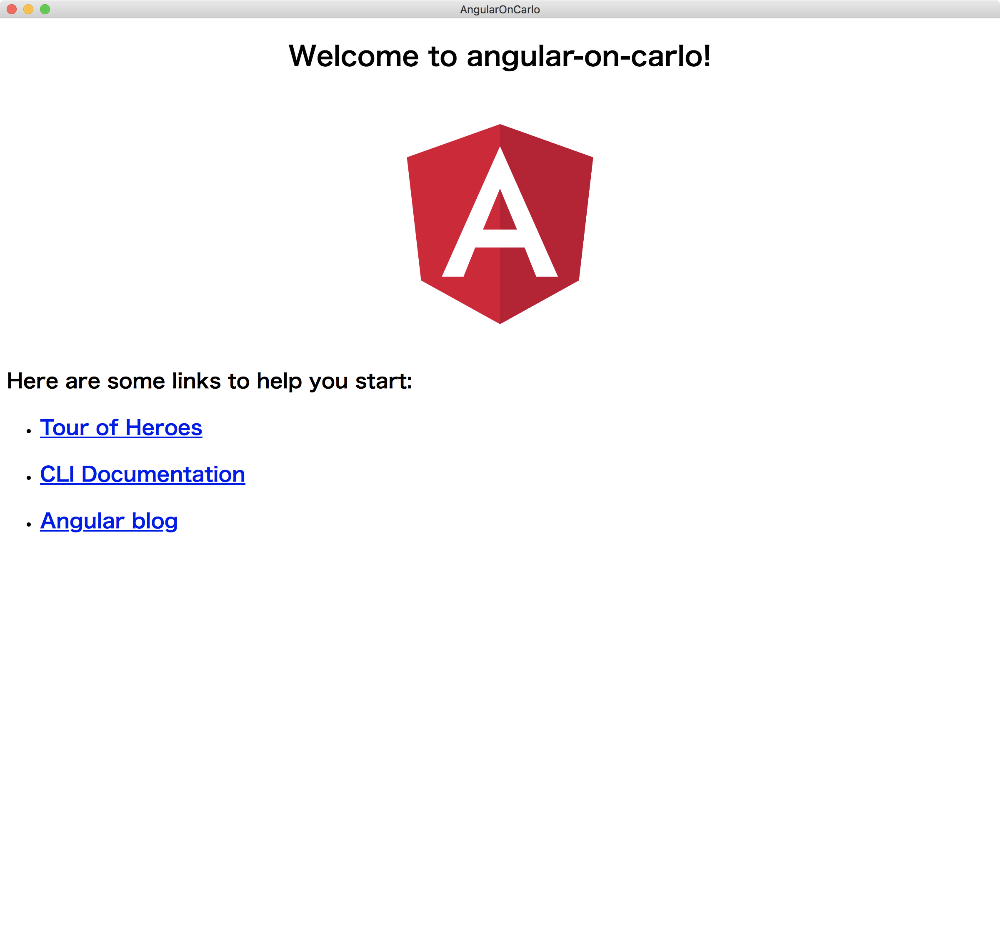

# Angular on carlo

## What's this?

A demo of turning [Angular](https://github.com/angular/angular)'s project into a desktop application by using [carlo](https://github.com/GoogleChromeLabs/carlo).

## How to use?

Running the `yarn start` command will build the Angular project and run the carlo process.

```bash
$ yarn start
 yarn run v1.12.3
 $ run-s build start:carlo
 $ ng build --prod

 Date: 2019-05-23T03:24:24.416Z
 Hash: aec56e5f54405128ea51
 Time: 18940ms
 chunk {0} runtime.26209474bfa8dc87a77c.js (runtime) 1.41 kB [entry] [rendered]
 chunk {1} es2015-polyfills.66d0882ecaa572e181ea.js (es2015-polyfills) 56.6 kB [initial] [rendered]
 chunk {2} main.ab101fdd138bcebb8653.js (main) 240 kB [initial] [rendered]
 chunk {3} polyfills.8bbb231b43165d65d357.js (polyfills) 41 kB [initial] [rendered]
 chunk {4} styles.3ff695c00d717f2d2a11.css (styles) 0 bytes [initial] [rendered]
 $ ts-node --project carlo/tsconfig.json carlo/main.ts
 ✨  Done in 32.41s.
```

The Angular app launches as a desktop app, as shown in the image below.



## License

[MIT](https://choosealicense.com/licenses/mit/)

## Author

[kamiazya(Yuki Yamazaki)](https://github.com/kamiazya)

[](https://ko-fi.com/W7W5VDNO)
